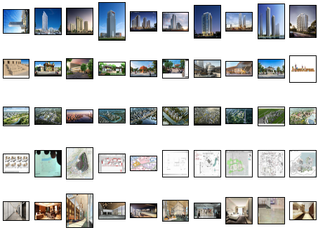

# Few-Shot Image Classification System (FSICS)
a graduation project

## Requirements

- Windows 10
## Python packages

- torch                        1.10.2
- torchaudio                   0.10.2
- torchvision                  0.11.3
- timm                         0.5.4
- pandas                       1.4.1
- numpy                        1.19.5

## Directory structure

- `checkpoint`  pre-trained backbone used to generate feature of images, you can acqiure open source pre-trained backbones at [CONFIG.md](https://github.com/NoSW/moco-v3/blob/main/CONFIG.md)
- `config` command-line argument files, e.g., the confing of `feature.py` is `feature.ymal`
- `csv` output of `feature.py`,  <image_path, label> pair list of dataset 
- `dataset` dataset of images after preprocessing (e.g. all images are RGB three-channel). The folder structure has no special requirements, modify your code according to `feature.py`
- `featute` output of `feature.py`, i.e., the features extracted by backbone
- `picture` reasearch results of my project
- `misc` miscellaneous python scripts for experimenting training tricks
- `moco-v3` open source repo forked from https://github.com/facebookresearch/moco-v3
- `utils`  common function implementations,e.g., linear, transforms etc.
- `feature.py` python script used to extract feature of dataset with specific backbone
- `real.py` python script used to train a liner classifier, then classify query set 

## Usage

#### Step 1: train a feature extractor (RECOMMENDED: Skipping this step by using a pre-trained checkpoint resided in `.\checkpoint`)

Build a vit-samll using single-node GPU by training on ImageNet
```
python main_moco.py \
  -a vit_small -b 1024 \
  --optimizer=adamw --lr=1.5e-4 --weight-decay=.1 \
  --epochs=300 --warmup-epochs=40 \
  --stop-grad-conv1 --moco-m-cos --moco-t=.2 \
  --dist-url 'tcp://localhost:10001' \
  --multiprocessing-distributed --world-size 1 --rank 0 \
  [your imagenet-folder with train and val folders]
```

Then, move the checkpoint to `./checkpoint/`

See [CONFIG.md](https://github.com/NoSW/moco-v3/blob/main/CONFIG.md) for more examples

#### Step 2: Compute feture of support set and query set

Check if checkpoint you used is added to the path list in `.\feature.py`, if ture, run

```
python feature.py \
    --image_size 224 \
    --batch_size 128 \
    --workers 8 \
    --dataset_path "dataset//support_real" \
    --set "supp"
```


and run

```
python feature.py \
    --image_size 224 \
    --batch_size 128 \
    --workers 8 \
    --dataset_path "dataset//query" \
    --set "query"
```
$(set_name).csv and $(set_name).npy are stored in `./csv` and `./feature` respectively

See `config\feature.ymal` for more config parameters about `feature.py`
#### Step 3: train a linear classifier 

```
python real.py \
      --logistic_batch_size 1 \
      --support_init_enabled True \
      --mixup_enabled False \
      --logistic_epochs 500 \
      --way 5 \
      --shot 10
      --support_npy "feature//support_real-mocov3-vit_small_s.npy" \
      --query_npy "feature//query-mocov3-vit_small.npy" \
      --out_path "real_result"  \
      --query_csv "csv//query.csv" \
```

See `config\real.ymal` for more config parameters about `real.py`

the results of classification will be stored in `./real_result/$(label_no)/$(img_no).jpg`

## **An example**

## a 5way-10shot support set
five classes, and 10 images per class:
- high rise
- low rise
- bird eye
- drawing
- indoor




## result on query set
### high-rise

### low-rise

### bird-eye

### drawing

### indoor
